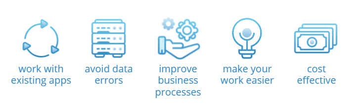

Helping you integrate Salesforce with other systems seamlessly is an absolute priority for us.

{: style="float: center"}

## Why choosing apps integration?

* As a business, you already rely on an array of applications that work with your business processes

* Whether you are about to start your **Salesforce** journey or you are just looking at improving your daily operations, integration is the perfect solution if you are looking at avoiding removing errors in data from duplicated entries across your platforms

* Integration is the best way to easily orchestrate your platforms to improve business processes. Implementing integrations is also a perfect time for you to review your processes and see if they can be improved - **it's often better to improve what's there than starting from scratch**

* It's also great for making sure your tech isn't making it harder to do your work

* Integrating is a huge **cost vs time** saver! Letting you and your team continue using what they are already well versed in using and making sure it sends the right information to your new or improved CRM is much more sensible than moving all operations to a single platform and updating all your existing processes

[Read our articles on integrations here to get an idea of what you can do](https://aocollab.tech/tags/#Integrations).
 
 

## The Salesforce Integration Portfolio
When we say that **Salesforce** integrates with hundreds and hundreds of existing platforms, we are not just saying it to impress - if you [go have a look for yourself on their Appexchange page](https://appexchange.salesforce.com/) you'll know what we mean. Their portfolio is one of the biggest available in the CRM market and the chances of you finding exactly what you are looking for are extremely high.

Here's a brief overview of what **Salesforce** has picked for app solutions for small businesses. They are all well known platforms with easy and seamless integrations that can be put in place out-of-the-box.

{% include contact-card.html img="assets/img/GoogleCloud.png" name="Google Workspace" role="Streamline your team's workflow and increase productivity by syncing G Suite by Google Cloud with Salesforce"}
{% include contact-card.html img="assets/img/Slack.jpg" name="Slack" role="Increase team collaboration and productivity with the Slack and Salesforce integration"}

{% include contact-card.html img="assets/img/MailChimp.jpg" name="MailChimp" role="Make it easier to manage email lists and contact records by connecting MailChimp and Salesforce"}

{% include contact-card.html img="assets/img/LinkedIn.jpg" name="LinkedIn" role="Target and engage the right buyers and save time, with the LinkedIn and Salesforce integration"}

{% include contact-card.html img="assets/img/Jira.jpg" name="Jira" role="Integrate Jira and Salesforce and make it easier to monitor the progress of your projects"}

{% include contact-card.html img="assets/img/Dropbox.jpg" name="Dropbox" role="Sync documents to keep files updated and organized, with the Dropbox and Salesforce integration"}

{% include contact-card.html img="assets/img/DocuSign.jpg" name="DocuSign" role="Connect DocuSign and Salesforce to send, sign, and track agreements and approvals on any device"}

 
 

---
## What integration solution can we help you with?

**Ao Collaboration** has a solution for all your **Salesforce** connectivity needs



---
 
 
