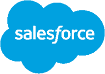

# why salesforce
{: style="float: left"; padding-right:"10px"}
[Salesforce is the leading CRM platform with 150,000+ customers worldwide](https://aocollab.tech/2020-11-28-what-is-crm-why-salesforce/). Their pillars are Innovation, Platform, Productivity, Mobility, Community - a strong recipe for businesses of any size, anywhere. It's cloud based, and it has out of the box and fully customisable solutions regardless of company size, which makes it perfect for the small players all the way here in New Zealand.

# why ao collaboration

Our talented team leverages both a wealth of Salesforce experience and deep understanding of the unique New Zealand market. By prioritising **people** and **process** we are able to create a connection with our customers that translates ideas into working solutions. We are here to help getting you started no matter where you are in your Salesforce journey, and only deliver what's essential for your business when you need it the most.

  
## how we do things

