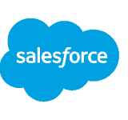
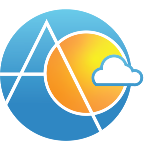
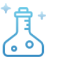
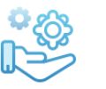
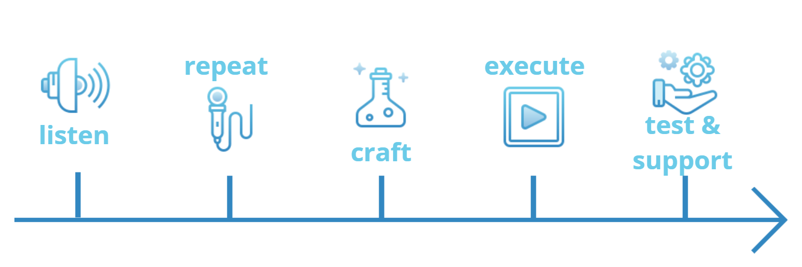

# why salesforce
{: style="float: right"}
[Salesforce is the leading CRM platform with 150,000+ customers worldwide](https://aocollab.tech/2020-11-28-what-is-crm-why-salesforce/). Their pillars are Innovation, Platform, Productivity, Mobility, Community - a strong recipe for businesses of any size, anywhere. It's cloud based, and it has out of the box and fully customisable solutions regardless of company size, which makes it perfect for the small players all the way here in New Zealand.
  

# why ao collaboration
{: style="float: right"}
Our talented team leverages both a wealth of Salesforce experience and deep understanding of the unique New Zealand market. By prioritising **people** and **process** we are able to create a connection with our customers that translates ideas into working solutions. We are here to help getting you started no matter where you are in your Salesforce journey, and only deliver what's essential for your business when you need it the most.
  

# how we do things
Every business is unique, and we live by this when we shape our proposed solutions for our customers.

Software and tools shouldn't be designed to 'fix' businesses, rather they should be designed to adjust to them. We work to make the platform work for the business by adapting it to its already existing processes, something we believe is vital to any healthy digital transformation.

### listen
{: style="float: left"}
Which is why the first thing we do is listen! It's great to package up solutions that many can utilise, however before we do that we focus on understanding our customers and what they are after (even when they are not entirely sure themselves!).
  

### repeat
{: style="float: left"}
Once we have understood the ins and outs of our clients requirements and we can confidently explain it back to them, we finalise a personalised proposal to give them an idea of what kind of magic happens in our Salesforce secret labs.
  

### craft
{: style="float: left"}
After agreeing on the proposal we happily go off and do our thing! Our primary focus is to maintain regular communication throughout projects and implementations so our clients know what we are up to! We believe in the importance of communication and do our best to honour it.
  

### execute
{: style="float: left"}
Now that the work is ready in our secret labs (also read 'sandbox') we implement it in our customer's environment, making sure the magic doesn't dissipate and all the bits and bobs are where they are supposed to be. This is usually a very exciting time both for us and our customers!
  

### test and support
{: style="float: left"}
At the end of the creative cicle, we test it all out to make sure we got rid of all the gremlins and everything is nice and tidy. Our customers usually take part in this, providing the unique set of fresh eyes and the experience of whose who will end up using our creation on a daily basis.
  
  

{: style="float: center"}
  
  

# our certifications

  

# want to have a chat with us?
Please contact us via email: <a href="mailto:{{ site.social-network-links.email }}">{{ site.social-network-links.email }}</a>
  
